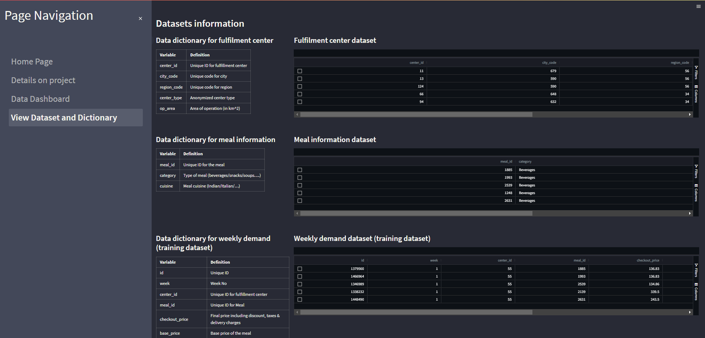

# About repository
This repository is for the 5-day AI Singapore Batch 12 Apprenticeship Programme mini project which is jointly contributed by the following apprentices:

- Goh Jong Ching.
- Cerise Choon
- Loi Xue Zheng
- Quek Zhi Qiang

The purpose of this mini project is to allow apprentices to work together and explore and experiment open-source tools available on the internet and utilise them to solve an identified problem statement of interest.

# Problem statement

The derived problem statement below is quoted from the actual link below this section as posted on Analytics Vidhya blog.

Your client is a meal delivery company which operates in multiple cities. They have various fulfillment centers in these cities for dispatching meal orders to their customers. The client wants you to help these centers with demand forecasting for upcoming weeks so that these centers will plan the stock of raw materials accordingly.

The replenishment of majority of raw materials is done on weekly basis and since the raw material is perishable, the procurement planning is of utmost importance. Secondly, staffing of the centers is also one area wherein accurate demand forecasts are really helpful. Given the following information, the task is to predict the demand for the next 10 weeks for the center-meal combinations in the test set:  
- Historical data of demand for a product-center combination (Weeks: 1 to 145)
- Product(Meal) features such as category, sub-category, current price and discount
- Information for fulfillment center like center area, city information etc.

Reference link: [Analytics Vidhya DataHack](https://datahack.analyticsvidhya.com/contest/genpact-machine-learning-hackathon-1/)


## Key deliverables
- To develop a useful forecasting dashboard using suitable open-source tools showcasing data insights and model predictions.
- To experiment and evaluate various time series model in answering the problem statement.

## Sample dashboard pages



# Results

We evaluated the performance of three different models: SARIMA, LSTM RNN, and Transformer, on a given time series dataset. The table below shows the RMSE values obtained for each model:

| Model      | RMSE   |
|------------|--------|
| SARIMA     | 95,951  |
| LSTM RNN   | 96,430  |
| Transformer| 86,509  |

Based on these results, we observe that the Transformer model performed the best, with the lowest RMSE value of 95,555.

# Current development status
- Not in active development since Apr 2023.

# Setup and Usage
To run the streamlit service, please clone this repository and install the necessary dependences as provided by environment.yml (using Anaconda distribution) or requirements.txt (Python pip package installer) using either of the following command:

Via Anaconda distribution:

```
conda env create --file=environments.yml

```

Via python pip:

```
pip install -r requirements.txt

```

Assuming the necessary dependences has been installed. Please execute the following script to start the streamlit service.

For Windows users: Please run the script `start_streamlit.bat` to start Streamlit service.

For Linux users: Please execute .sh script is developed for Linux users, but not testing has been done. (**Note: This script is added for convenience but has yet to test out on actual machine.**)

## Special folders.

- Pkl files should be placed in corresponding subfolders (Statistical Model/Machine Learning/Deep Learning) under `models` folder.

**Please note that only statistical model involving SARIMA is available on the Google Drive link above due to space constraint.**

# EDA works

## Basic EDA:
-  
    - Our data has 456548 row and 15 columns.
    - Our target is “num_orders” and timestamp is in weeks 
    - Numerical columns = 10, Categorical columns = 3 (note that other columns like ID can be categorical as well)
-  
-  
    - Looking at ‘checkout_price’ and ‘base_price’, their values present a very different range and magnitude. Hence, we should standardize the data as the data follows Gaussian distribution. Note that the target is not standardized here.
-  
    - 'Checkout_price' and 'base_price' has high positive correlation (0.95). Make sense as checkout_price is just base_price with discount, shipping fee, tax.
    - Hence, high correlated features like 'Checkout_price' and 'base_price'. Drop 'Checkout_price' and replace with 'adjusted_price' (difference between checkout and base price).
    - Other observations: 
        -  Both 'homepage_featured' and 'emailer_for_promotion' are positively correlated to num_orders. This makes sense as when there are promotions or items featured, the orders will increase.
        - 'homepage_featured' are positively correlated to 'emailer_for_promotion'. It seems like whenever there is a promotion, the item will likely to be featured on main page.
        - Both 'Checkout_price' and 'base_price' are negatively correlated to 'num_orders' as price increase, the number of orders should decrease. 

## General preprocessing:
- Remove useless columns (eg. id)
- Remove ‘checkout_price’ (high correlation feature) and replace with a price difference column (checkout_price - base_price)
- Standardize via standscaler for specific columns (eg. exclude ‘num_order’)
- One-hot encode for categorical features
- Further preprocessing will be done for each of the model.
- Note that due to time constraint, we will only be using univariate data (target only) for all models used in this project. This preprocessing pipeline will be used for multivariate time series analysis (future improvement).  


## **Model 1:** SARIMA model as our baseline model
We began with a SARIMA (Seasonal Autoregressive Integrated Moving Average) model as our baseline model.SARIMA is a popular model for modeling time series data with seasonality.

The SARIMA model considers the autoregressive and moving average components of a time series, as well as the seasonality of the data. The model is specified by three parameters: p, d, and q, which correspond to the order of the autoregressive, integrated, and moving average components, respectively. Additionally, the model includes seasonal components specified by P, D, and Q, which are similar to the non-seasonal parameters but apply to the seasonal differences and seasonal errors.

We started by performing a seasonal decomposition of the time series, which showed clear trends and seasonality in the data. We also conducted an Augmented Dickey-Fuller (ADF) test to confirm that the data was not stationary. Next, we analyzed the autocorrelation function (ACF) and partial autocorrelation function (PACF) plots to determine the appropriate orders for the SARIMA model.

After fitting the SARIMA model to the data, we obtained an RMSE of 95,951.

 

Template from https://24slides.com/ 

## **Model 2:** Long-Short-Term-Memory (LSTM) Model
### Brief intro to LSTM
- RNNs are a type of neural network architecture that is designed to handle sequential data by maintaining a memory of previous inputs. In RNNs, the output of a hidden layer is fed back to the input of the same layer in the next time step. However, the main disadvantage of RNNs is the vanishing gradient problem, where the gradients of the earlier time steps become smaller and smaller, which results in difficulty in training the network and retaining long-term memory.

- LSTMs are a type of RNN that overcomes the vanishing gradient problem by introducing a memory cell and three gating mechanisms, namely the input gate, forget gate, and output gate. The memory cell helps the network to remember important information over longer time periods, while the gating mechanisms control the flow of information into and out of the cell. The forget gate decides which information should be discarded from the cell and the input gate decides which new information should be added to the cell. The output gate decides the output of the cell at the current time step.


Image from: https://www.v7labs.com/blog/neural-network-architectures-guide

### Training an LSTM model on our food demand data involves the following steps:

1. Data Preprocessing: Using our 'datapipeline.py', we will preprocess the data. 

2. Windowing: The data is then windowed, which involves creating overlapping sequences of data points to be used as inputs to the LSTM. We use the 'preprocess_window.py' to generate a normalized train and test torch.tensor dataset. The lookback and lookforward for this project is both 10 respectively (train on past 10 weeks data and predict advance 10 weeks data). 

3. Model Definition: The LSTM RNN model is defined, specifying the number of layers, the number of neurons in each layer, and the activation function to be used. 
    - The number of LSTM cell used here is 50 and the number of layers is 1.
        - Further hyperparameter tuning can be done by adjusting the hidden_size and num_layers. 
    - nn.Linear() is used here as Linear activation function simply returns the weighted sum of inputs plus a bias term, and is useful for regression problems where the output is a continuous value.
```
class LSTM(nn.Module):
    def __init__(self,input_size, hidden_size, num_layers):
        super().__init__()
        self.lstm = nn.LSTM(input_size=input_size, hidden_size=hidden_size, num_layers=num_layers, batch_first=True)
        self.linear = nn.Linear(hidden_size, 1)
    def forward(self, x):
        x, _ = self.lstm(x)
        x = self.linear(x)
        return x
```

4. Model Training: The model is then trained on the windowed data using an appropriate optimization algorithm, such as Adam.
    - Further hyperparameter tuning can be done by using different optimizer like RMSProp, Adagrad, SGD. 
5. Model Evaluation: The trained model is then evaluated on both test and train dataset to measure its performance and to determine if any further modifications to the model are necessary. In this project, we are using RMSE to evaluate our model.
    - Results:
        -  
        -  
        - Test RMSE:  96,430.12. Train RMSE:  9,501.999

## **Model 3:** Transformer
Transformers are known for being a state-of-the-art solution to Natural Language Processing (NLP) tasks. However as they are designed to process sequential input data, they can also be used in other tasks such as time series forecasting. 

The encoder part takes the history of the time series as input while the decoder part predicts the future values in an auto-regressive fashion. The decoder is linked with the encoder using an attention mechanism. This way, the decoder can learn to “attend” to the most useful part of the time series historical values before making a prediction.
The decoder uses masked self-attention so that the network can’t cheat during training by looking ahead and using future values to predict past values. Positional encoding to provide information about the position of the tokens in the sequence

The training and inference loops are different as different inputs are required. For training, the ground truth is fed into the decoder. For inference, it is autoregressive, where the first predicted output is fed back into the decoder. 


When the model is switched to evaluation mode, the predicted values are exactly the same for the entire forecast horizon. In contrast, not switching to evaluation mode returns predicted values which are different from each other. When the model is in evaluation mode, the BatchNorm layer applies normalization using the learned statistics from the training phase, and dropout is disabled. This helps in generating consistent predicted results. 

In our case, the model does not use any BatchNorm layer, but it does use dropout layers, specifically in the positional encoding layer. Since the positional encoding layer adds a fixed representation to the input sequence, it may cause the model to overfit to the training data. This is because the model may learn to rely too heavily on the positional encoding layer's fixed representation, rather than learning the underlying patterns and relationships within the input sequence. Hence dropout is used in the positional encoding layer.  

Disabling the dropout layer would effectively disable positional encoding, resulting in constant predicted values. To generate non-constant predicted values, the model is not switched to evaluation mode, and instead a random seed is set to ensure consistency in the predictions. However, the model seems to be underfitting as the predicted values fall within a narrow range, as compared to the actual values which have a much larger range. 


## Future Improvement 
- To further improve the performance of the **SARIMA model**, we can explore hyperparameter tuning techniques. This can involve changing the values of the SARIMA model's order and seasonal_order parameters, or using more advanced techniques such as grid search or Bayesian optimization. Hyperparameter tuning can help us find the optimal set of hyperparameters that can improve the model's performance on the test set.
- To further improve the performance of our neural network model, we can adjust hyperparameters of the model. This includes the number of layers, number of neurons per layer, dropout rate, learning rate, batch size, number of epochs, window size (lookback), sequence length (lookforward) and activation functions.
- So far we only use target variable to train the model. To further improve performance of the model, we can input the other features to train the model as including other features can help the model capture complex relationships between the variables and reduce the impact of noise and outliers in the data.  
